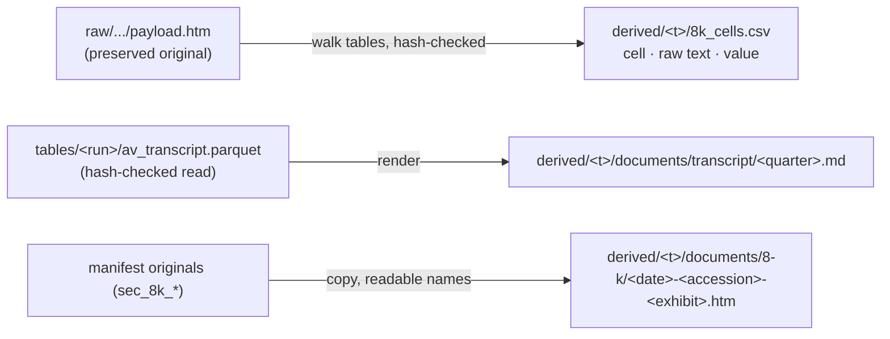

# Plan: typed derived views + 8-K numbers as CSV

Date: 2026-09-21 · Original request: "1. can we simplify the folder structure? maybe by
type of data? e.g. 10ks/ 10qs/ 8ks/ transcripts/ … subfolders csv/ parquet/ 2. is there a
robust way and consistent way to pull the 8ks numbers from .html in a e.g. csv?" ·
Working dir: `/Users/eliasdiab/Dev/financial_data_pull` · Branch: `main` (uncommitted tree)

## Goal and scope

Answer both questions with one small addition to the library:

1. **Do not restructure the store.** Its folders (`raw/`, `tables/`, `coverage/`, `csv/`)
   are load-bearing: one pull publishes one sealed snapshot that is simultaneously the
   atomicity unit, the cache-identity unit and the hash-check unit. Instead add a
   **derived, rewritable view** that carries human names and the type groupings the user
   asked for — without moving anything.

2. **Extract the 8-K numbers to CSV at cell level**, filer-agnostically. A per-ticker
   metric map ("Adjusted diluted EPS = …") is an explicit follow-on, not in this plan.

Out of scope: store re-layout; per-ticker metric extraction; parsing 10-K/10-Q primary
documents; any change to `save_raw`, `commit_snapshot`, `read_verified_table`, scope keys,
coverage or snapshot publication.

## Evidence gathered (read-only, already done)

- The cached Exhibit 99.1 files contain **9–20 flat `<table>` elements, zero nesting**,
  and **no inline XBRL** (`ix:nonFraction` = 0) — so HTML parsing is the only route and a
  header/row walk is tractable.
- Layout differs per filer: VRT splits the GAAP→adjusted bridge across four tables; AVGO
  puts GAAP and Non-GAAP side by side in one. Cell-level output is therefore the only
  filer-agnostic shape; metric-level output needs a per-filer label map.
- Real traps seen in the data: cell text lives in nested `<span>` (naive `.text` returns
  empty), headers are colspan/rowspan multi-row, values appear as `$ 2,810.6`, `(3.9)`,
  `26.1 %`, `—`, `+86`, and labels carry footnote markers like `Diluted EPS(1)`.
- Cached transcripts (AVGO 2024Q2…2026Q3, VRT 2026Q1–Q2) are clean plain text: columns
  `quarter, segment, speaker, title, content`; **no HTML, no entities, no embedded
  newlines**; only en/em dashes and curly apostrophes outside ASCII; 32–66 turns per call.

## Plain-English summary (for the user)

- **Structure: no to reshuffling the store, yes to a typed view on the side.** A pull must
  publish one folder atomically; splitting by type breaks that, leaves `yahoo_*` and
  `av_earnings_estimates` without a bucket, and cannot type `raw/` (one filing payload
  holds many documents). So: keep the store, add `data/derived/<ticker>/` with
  `documents/8-k/`, `documents/transcript/` and `8k_cells.csv`. 10-K/10-Q are left in
  `raw/` on purpose: their only original is a ~9 MB full-text submission, and copying
  those would add ~100 MB per ticker for a file nobody reads directly — their statements
  are already in `data/csv/`.
- **Numbers: yes, and the cell dump is the robust half.** One row per cell, with the raw
  text kept beside the parsed value so a bad parse is visible instead of silent, blanks
  where the value is not a number, and a hash-verified source.
- **Transcripts as `.md`.** Derived view renders each call to Markdown (one file per
  quarter) from the hash-verified `av_transcript` table. The untouched AV JSON stays the
  evidence in `raw/`; the CSV stays the tabular form.

## Layout

```
data/tables/ · data/coverage/ · data/raw/ · data/csv/     unchanged (store = truth)

data/derived/<issuer>/                                    NEW, derived, rewritable
├── documents/8-k/<filing_date>-<accession>-<exhibit_file>       copies of preserved exhibits
├── documents/transcript/<quarter>.md                            rendered call transcript
└── 8k_cells.csv                                                  every cell of every release table
```



## Success examples (acceptance criteria)

1. `financial-data-pull VRT --export-views` creates `data/derived/VRT/documents/8-k/` with
   10 exhibit files, `…/documents/transcript/` with 2 Markdown files, and
   `…/8k_cells.csv`; every copied exhibit is sha256-equal to the preserved original it
   came from, and a second run writes nothing.
2. `data/derived/VRT/8k_cells.csv` has one row per `<td>/<th>` cell of every table in
   those 10 releases (row count equals the parsed cell count — nothing silently dropped),
   and every row carries `accession`, `filing_date`, `exhibit_sha256`, `table_index`,
   `caption`, `row_kind`, `row_index`, `col_index`, `row_label`, `column_label`,
   `raw_text`, `value`, `unit` — `row_kind` is `header` for header cells so downstream
   users can drop them programmatically instead of re-inventing header detection.
3. `data/derived/AVGO/documents/transcript/2026Q3.md` reads as a normal call transcript
   (title, source line, one speaker turn per paragraph), is byte-identical on re-run, and
   the GAAP revenue / net income / diluted EPS cells in `8k_cells.csv` for the Q2 2026
   VRT release tie to the matching period in `income_quarterly_0.parquet`; corrupting one
   digit in a cached exhibit makes that tie-out fail rather than pass silently.

## Relevant files

- `src/financial_data_pull/views.py` (new) — documents view + transcript Markdown +
  8-K cell dump.
- `src/financial_data_pull/store.py` — add the `DERIVED` root constant only.
- `src/financial_data_pull/pull.py` — read `sec_8k` / `av_transcript` from the store
  (newest snapshot carrying each; per-filing / per-quarter newest-carrying rule, mirroring
  `export_csv`). No changes to publish, cache or scope logic.
- `src/financial_data_pull/cli.py` — `--export-views` flag (offline; refuses acquisition
  flags, same as `--export-csv`). `--export-csv` behaviour unchanged.
- `pyproject.toml` — pin `lxml==6.1.3` as a direct dependency (today only transitive via
  edgartools; pins are load-bearing here).
- `tests/test_views_offline.py` (new) + `tests/run_all.sh` (add the suite).
- Docs: `README.md` (layout + derived views), repo `AGENTS.md` (one convention line), the
  `pull-financial-data` skill, and separately
  `/Users/eliasdiab/Desktop/VRT model/AGENTS.md` (point its store table at the new
  document paths).

## Implementation units

1. **Derived documents view.** Add `DERIVED = DATA / "derived"` to `store.py` (extend
   `tests/test_store._TempPlane` to save/restore it). In `views.py`, for an issuer:
   - collect every published snapshot's manifest `originals` newest-first; for each
     `sec_8k_<accession>` copy the payload to
     `derived/<issuer>/documents/8-k/<filing_date>-<accession>-<exhibit_file>` using the
     `sec_8k` row's `filing_date` and `exhibit_file` (fall back to the file's own name),
     taking each accession once (newest wins);
   - before copying, verify the payload's sha256 equals the content-addressed directory
     name it sits in; on mismatch, abort with a message naming the file — never copy
     unverified bytes;
   - copy only when the destination bytes differ; never delete unrelated files.
   Done when the 10 VRT and 10 AVGO exhibits are present under readable names and hash-equal
   to their sources.
2. **Transcript Markdown.** For each quarter in `av_transcript` (per-quarter newest-carrying
   across snapshots, quarters ascending), read the table through `read_verified_table` and
   render `derived/<issuer>/documents/transcript/<quarter>.md`:
   `# <TICKER> — <quarter> earnings call transcript`, then a one-line source note
   (`Alpha Vantage EARNINGS_CALL_TRANSCRIPT · snapshot <run-id> · generated — do not edit`),
   then per segment in `segment` order a `**<speaker>** — *<title>*` line followed by the
   content paragraph. Render every segment, including blank-content ones (no silent drops).
   Output must be deterministic: no wall-clock text, no ordering by dict iteration.
   Done when AVGO has 10 `.md` files and VRT 2, each readable top-to-bottom as a call.
3. **8-K cell dump.** For each filing in the newest snapshot carrying `sec_8k`, parse its
   `exhibit_path` with lxml and walk `<table>` elements in document order, emitting one CSV
   row per `<td>/<th>` to `derived/<issuer>/8k_cells.csv` with the columns listed in
   success example 2. Extraction rules: cell text via `itertext()` whitespace-flattened
   (never `.text`); `row_label` = the row's leading label cells concatenated with a space;
   `column_label` = the header cells above the value's column resolved through
   rowspan/colspan, blank when unresolvable (indices always present); `row_kind` = `header`
   when the cell is a `<th>` or sits inside `<thead>`, else `data`; `caption` = nearest
   preceding non-table text block, else the table's first row, truncated to 120 chars.
   `value` normalisation: strip NBSP/spaces/`$`/`%`/`,`/trailing footnote markers;
   parentheses → negative; `+` prefix dropped; `—`, `–`, `N/M`, empty → blank; anything that
   still does not parse → blank `value` with `raw_text` intact. `unit` records `$`, `%`,
   `shares` when the cell or its column header states one, else blank. Order rows by
   `filing_date` desc, then `table_index`, `row_index`, `col_index` for a byte-stable file.
   Done when VRT and AVGO dumps exist and row counts equal the independent cell counts.
4. **CLI + docs.** Add `--export-views` (no network, exit 0, refuses `--refresh`,
   `--sources`, `--transcripts`, `--earnings-8k`, `--ceiling` exactly as `--export-csv`
   does). Print one summary line per group, e.g. `documents/8-k: 10 files`,
   `documents/transcript: 2 files`, `8k_cells.csv: 41,904 rows`. Update README (layout block
   + short "Derived views" section stating they are rewritable and never evidence), one
   AGENTS.md convention bullet (`data/derived/` is derived, never evidence; `data/csv/`
   keeps its flat paths), the skill (documents now at `data/derived/<ticker>/documents/…`,
   transcripts readable as Markdown), and the Desktop model's AGENTS.md store table.
5. **Tests.** New offline suite, providers doubled and wrapped in `_TempPlane`:
   - a ~4 KB synthetic exhibit fixture carrying the real traps (nested `<span>` text,
     colspan multi-row header, rowspan label column, `$ 637.9`, `(3.9)`, `26.1 %`, `—`,
     `Diluted EPS(1)`, `1,234`) → assert exact dump rows including `column_label`,
     `row_kind` and `value`;
   - completeness: dump rows == parsed cell count of the fixture;
   - determinism: render twice → byte-identical CSV and MD;
   - documents: readable names, sha equal, second run writes nothing, a tampered original
     aborts instead of copying;
   - transcript MD: synthetic multi-quarter segments (repeated speaker, non-ASCII dash,
     blank content) → exact expected Markdown, one file per quarter.
   Add the suite to `tests/run_all.sh`.
6. **Real-data verification (no code).** Run `--export-views` for VRT and AVGO; confirm the
   success examples; open one derived `.htm` in a browser and one `.md` in an editor; run
   the GAAP tie-out (revenue, net income, diluted EPS for one quarter) against the
   statement parquet; break one digit in a scratch copy of an exhibit and confirm the
   tie-out fails. Then re-run `bash tests/run_all.sh`.

## Risks and dependencies

- **Header resolution is the only fiddly part.** The blank-`column_label` fallback keeps it
  honest; if the real-data check shows it is unreliable, ship `col_index` only and let the
  consumer read the header rows, which are dumped as their own `row_kind='header'` rows.
- **Per-filer table drift** is expected at cell level and costs nothing; it becomes
  maintenance only if the metric layer is added later.
- Disk: derived views add ~6 MB per ticker (VRT/AVGO). Excluded 10-K/10-Q copies would have
  added ~100 MB per ticker.
- `lxml` pin: the parser is currently installed only transitively; pinning makes the
  dependency explicit and keeps Parquet/HTML round-trips reproducible.
- The Desktop model folder is a separate non-git project; its AGENTS.md edit is outside this
  repo's change set and is done by hand.

## Explicitly deferred (needs a separate decision)

**Metric-level extraction** — `sec_8k_metrics.csv` with Adjusted diluted EPS, adjusted
operating profit/margin, adjusted FCF, organic growth, guidance ranges. It needs a
per-ticker label map (VRT and AVGO already differ structurally) plus arithmetic validation
(GAAP + adjustments = adjusted; margin = adjusted ÷ revenue), and it is the point where
this library would start interpreting rather than acquiring. Recommended order: ship the
   cell dump, use it for the model, then decide whether the map lives here or downstream.
   The intended consumption pattern is **cell dump here, mapping downstream**: the library
   ships no metric interpretation, so per-ticker label maps never get rebuilt inside it
   by accident.
